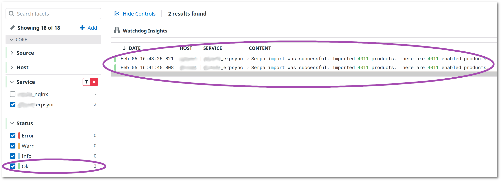

# Installation

```bash
composer require konekt/extended-logger
```

## Usage

```php
$logger = new \Konekt\ExtLogger\Loggers\PythonLogger('some_erpsync');
// Do the heavy operation
$logger->ok('Serpa import was successful. Imported 4011 products. There are 4011 enabled products.');
```

The log processor of your choice (Datadog, Newrelic, Papertrail, etc) can recognize it as a
structured data:



---

**Next**: [Python Logger &raquo;](python-logger.md)
