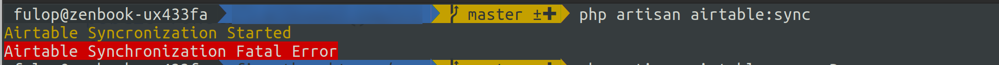
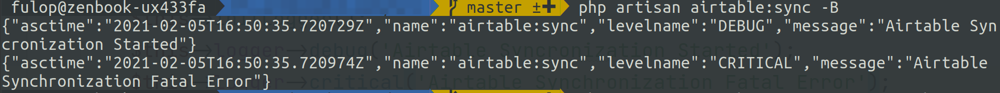
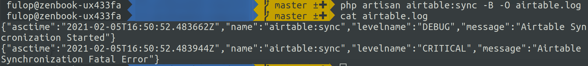

# Laravel Command Logging

Laravel Artisan commands (with Symfony console component under the hood) offer a simplified styling
of the console output. The `LaravelCommendLogger` is a PSR-3 compatible logger that can be used
within Artisan console commands to display log lines as decorated output.

```php
use Illuminate\Console\Command;
use Konekt\ExtLogger\Loggers\LaravelCommandLogger;

class SynchronizeWorklogs extends Command
{
    public function handle()
    {
        $logger = new LaravelCommandLogger();
        
        $logger->info('Hey');
        //is equivalent to:
        $this->info('Hey');
        
        $logger->notice('Yo!');
        //is equivalent to:
        $this->line('Yo!');
    }
}
```

Why complicate, why not just use `$this->info()` or `$this->line()`? The question is perfectly
valid. It makes no sense to use this logger if you only want to output lines to the console.

This class makes sense if your command needs to be ran both manually and periodically in the
background. In this case you can easily replace the logger depending on the context where the
command runs (foreground or background).

## Using The Utility Trait

The package contains the `HasContextualLogger` trait, that simplifies this particular scenario.

Using this trait, your commands can:
- log to the console output, for usual human interaction
- log to another format (typically JSON) either to the console output or to a file passed as argument

**Examples**:

```bash
# Messages are written in the usual, decorated format to the terminal
php artisan airtable:sync

# Batch mode on, message are written as JSON to the console output:
php artisan airtable:sync --batch

# Batch + file mode on, message are written to a file in JSON format:
php artisan airtable:sync --batch --output=/var/log/airtable/sync.log
```

**The output in "normal" mode**:



**Output in batch mode**:



The output is JSON and it's written to stdout, but it can be redirected to file using the shell.

**Output in batch + file mode**:



In this mode, the log lines get directly written to the log file passed in the argument, and nothing
gets written on the terminal output.

### Command Equipment

To utilize the given batch, add the `HasContextualLogger` trait to your command and invoke the
`$this->initLogger()` method:

```php
class SyncWithAirtable extends Command
{
    use HasContextualLogger;

    protected $signature = 'airtable:sync
            {--O|output= : The filename to write log messages to. Batch mode must be enabled.}
            {--B|batch-mode : Logs in JSON format if set}
    ';

    public function handle()
    {
        $this->initLogger();
        $this->logger->debug('Airtable Syncronization Started');
        // Do the operation
        $this->logger->ok('Airtable Synchronization Completed');
    }
}
```

The default options are `--O|output` and `--B|batch-mode`. You need to add these options manually
to your command signature, as seen above.

### Customizing The Command

You can customize many of the aspects of this command.

#### Use Custom Command Line Arguments

You can use different command line arguments for switching to batch and file mode logging.

```php
class JiraSync extends Command
{
    use HasContextualLogger;
    
    protected $signature = 'jira:sync
            {--L|logfile= : The filename to write log messages to. Batch mode must be enabled.}
            {--B|background : Logs in JSON format if set}
    ';
    
    // php artisan jira:sync --background
    private $batchModeOptionName = 'background';
    
    // php artisan jira:sync --background --logfile=jira-sync.log
    private $logToFileOptionName = 'logfile';
}
```

#### Use Custom Logger for Batch Mode

By default, the Python JSON Logger is being used for batch mode logging. You can use any other
logger that implements `Psr\Log\LoggerInterface`.

If the class can be created without constructor arguments, simply set the `batchLoggerClass`
attribute on the command class:

```php
class SomeCommand extends Command
{
    use HasContextualLogger;
    
    private string $batchLoggerClass = TomlPsrLogger::class; 
}
```

This will create logs with the `TomlPsrLogger` class when in batch mode.

If your logger requires a bit more complex setup, you can implement the `createBatchLogger()` method
in your command class:

```php
class SomeCommand extends Command
{
    use HasContextualLogger;
    
    private function createBatchLogger(): LoggerInterface
    {
        // Create a New Relic logger
        $newrelic = new SobanVuex\NewRelic\Agent('MyApp');
        $newrelic->backgroundJob();
        
        return new SubjectivePHP\Psr\Log\NewRelicLogger($newrelic);
    } 
}
```

This will result the logs to be sent to NewRelic when in batch mode.

#### Customize The Service Name (PythonLogger)

If using the default Python JSON batch logger, the service name is the command name by default.

This can be customized by setting the `serviceNameForLogs` property on the command class:

```php
class GDPRAnonymize extends Command
{
    use HasContextualLogger;
    
    private string $serviceNameForLogs = 'gdpr-anonymizer'; 
}
```

